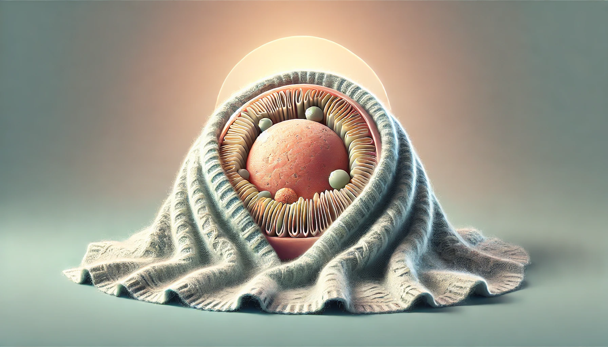
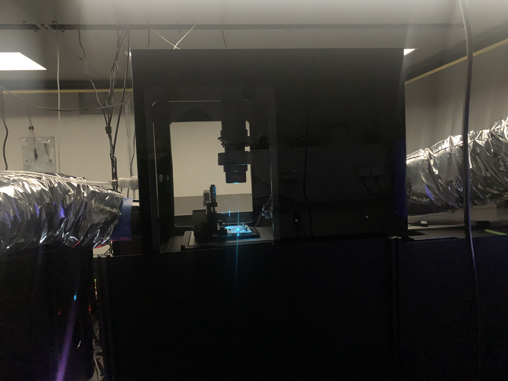
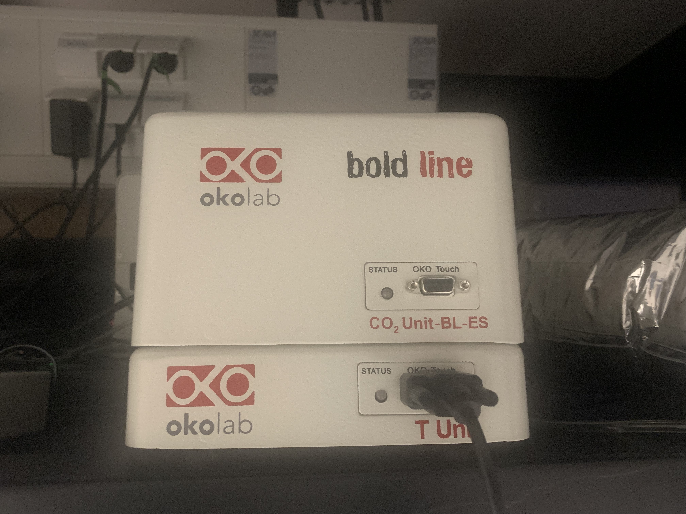
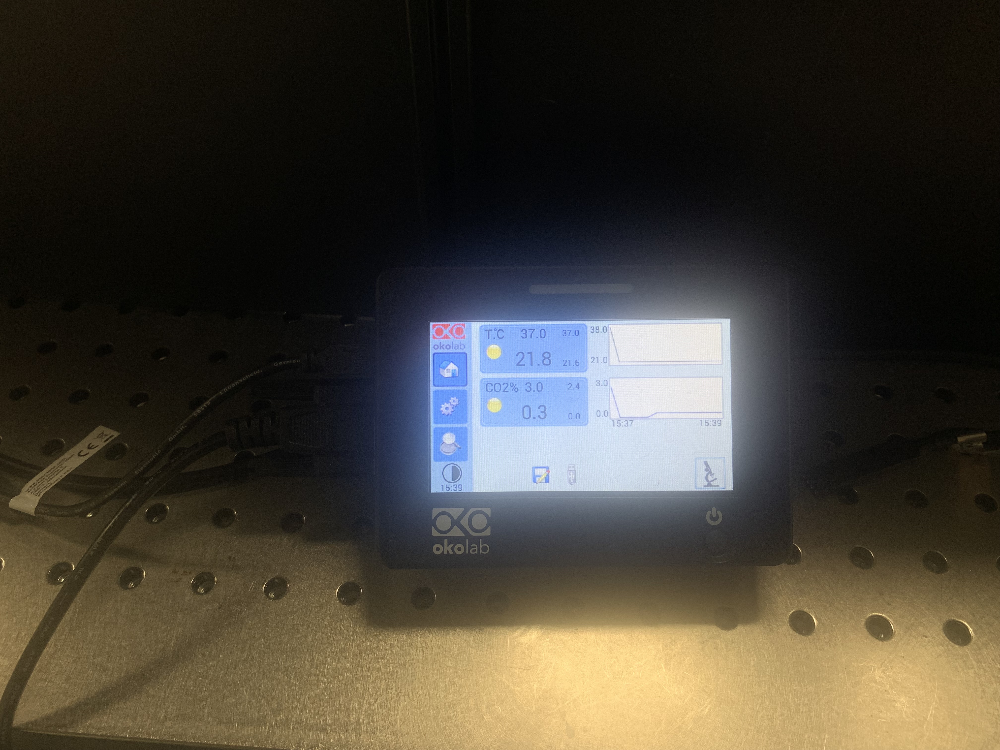
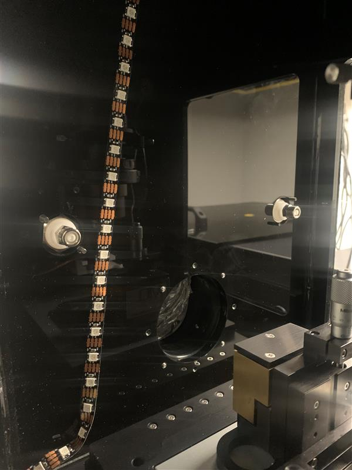
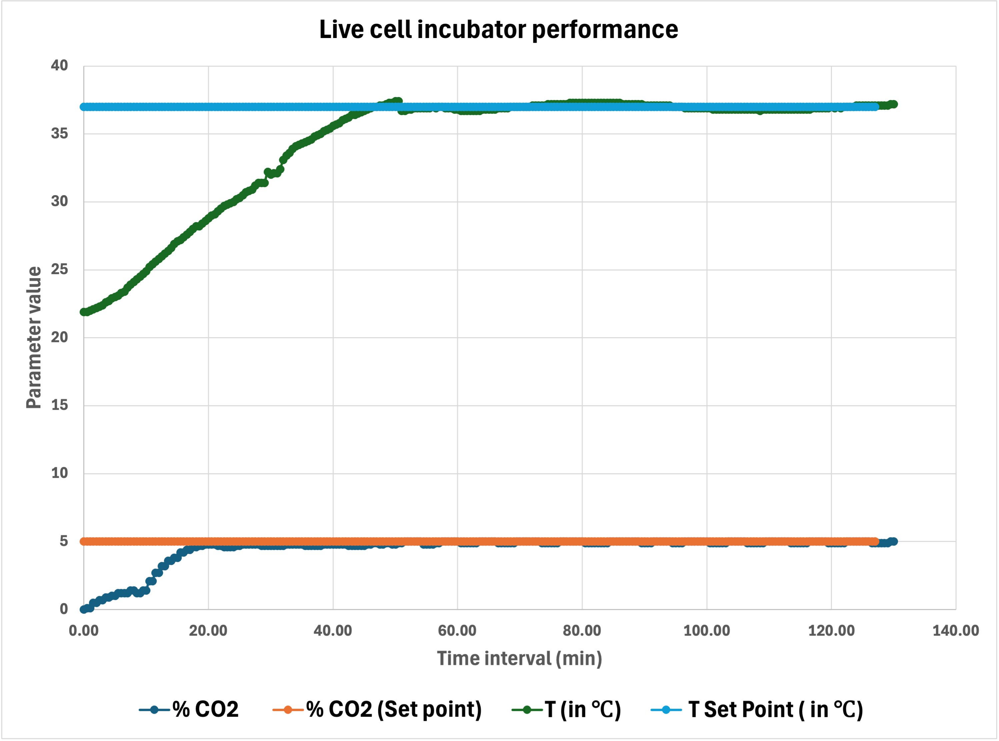

# RM21Blanket - a live cell incubator 
 
Live cell experiments have become routine in the past decade or so and thus, a well-documented, (easy to adapt) open-source incubator design will be helpful to the life sciences community.

In this project we have developed a live cell incubator with environmental controls for our home-built microscope based on the [RM21 platform by Mad City Labs](https://www.madcitylabs.com/rm21.html). This was the second iteration of our incubator chamber as the first version faced certain leakage and robustness issues. Our current design addresses these issues and incorporates several key features of an "ideal" incubator for live cell imaging:

1. Precise temperature control: Maintains a stable temperature, typically around 37°C for mammalian cells, with minimal fluctuations using commercial Oko Lab temperature control units.
2. Gas control: Accurate CO2 regulation (typically 5%) using Oko Lab CO2 control units, ensuring a consistent atmospheric environment.
3. Optimized flow dynamics: Careful consideration given to the flow and distribution of hot air and CO2 within the chamber for uniform environmental conditions.
4. Minimal evaporation and condensation: Use of closed ibidi dishes or sealed chambers significantly reduces these issues.
5. Compatibility: Designed for easy installation and compatibility with our home-built microscope setup.
6. Data logging: Utilizes Oko Lab control monitor for recording environmental parameters.
7. Multiple channel control: Ability to control temperature and CO2 parameters simultaneously for precise environmental regulation.
8. Minimal disturbance: Design allows for long-term imaging with minimal interference to the sample.
9. Design and Material choices: Black non-translucent PMMA material was chosen to fabricate the chamber based on its temperature tolerance, and also to avoid instances of stray light. The chamber has a door for easy mounting and access to the sample. Two sets of the door have been fabricated and can be easily interchanged- one with a transparent PMMA and one with the black non-translucent PMMA. For experiments involving microfluidic devices or specialized culture platforms, a transparent door allows researchers to easily check for issues like air bubbles, media evaporation, or unexpected cell behavior without compromising the experimental conditions.

While our current design doesn't include active humidity control or O2 regulation, the sealed environment and optimized flow dynamics help maintain stable conditions suitable for most standard cell culture experiments.

# Current State of the Project
Our live cell incubator project has successfully completed its second iteration, addressing leakage and robustness issues from the first version. 

  

All the technical drawings, design files and bill of materials for the current version are available in the [project repo](https://github.com/GrussmayerLab/live-cell-incubator/). You can find the detailed [build instructions here]({{site.baseurl}}/build_instructions.html). Other than the mechanical parts listed in the BOM required to manufacture the chamber, you will also need:  

| Item| Quantity | Product Link| |
|----------|----------|---------|----|
| Temperature control unit from Oko Lab with a chamber temperature sensor and a sample temperature sensor  | 1  | https://www.oko-lab.com/live-cell-imaging/cage-incubator/temperature-unit |   |
| CO2 control unit from Oko Lab  | 1   | https://www.oko-lab.com/gas-mixing/for-microscope-incubators/co2-unit-bl |  
| CO2 sensor   | 1  | | |
| Touch screen interface unit from Oko Lab  | 1  | https://okolab4microsystems.com/okolab_codes/oko-touch/ | 
| LED strip lights (optional)   | 1m  | Generic |  

# Testing and Validation
The incubator has been tested and is able to maintain contant temperature and CO2 levels for 4+ hours. We haven't tested extended durations yet as we do not currently image live cells for longer durations. A cell viability assay post imaging for 4 hours with the incubator resulted in only about 6-8% decline in viability.

  

# Future Plans
An active point of focus with respect to this design is to minimize environmental fluctuations while exchanging samples during imaging. The chamber door in our current design is relatively large which might mean everytime the door is opened, there could be sudden sharp fluctuations in the chamber equilibrium. In our testing, however, these effects weren't significant and the equilibrium is quickly maintained again. This could be because of the position of the gas inlet and outlet points with respect to the position of the door. Nevertheless, it is always advisable to go for a smaller door whenever possible. The incubator chamber can also be of a smaller footprint if it is designed just for fluorescence imaging and therefore, need not enclose the Koehler lamp as it does in the current design. 

Although not necessary at this point of time for our work, there is the option of exploring active humidity control for the incubator, if needed for specific experiments. This would also entail the issue of condensation which could potentially damage the optomechanics housed within the incubator chamber, so considerations have to be made accordingly. Additionally, for experiments requiring strictly hypoxic conditions, an active O2 control would be a good choice.

# Getting Started and Project Support
The information provided on this page should be sufficient for anyone looking to build a live cell incubator for imaging experiments for their microscope. Please report any questions or even suggestions you might have for us, using the "Issues" tab on our [github repo](https://github.com/GrussmayerLab/live-cell-incubator/issues) for this project. 

# License Information

# Special Thanks
This project was funded by the Open Hardware Stimulation Fund of the [Delft Open Hardware initiative](https://www.tudelft.nl/open-hardware/about-us). The chamber was designed by Frank Schilder and Moritz Engelhardt and developed by Frank, Moritz, and  Niek van Zon from TU Delft.
